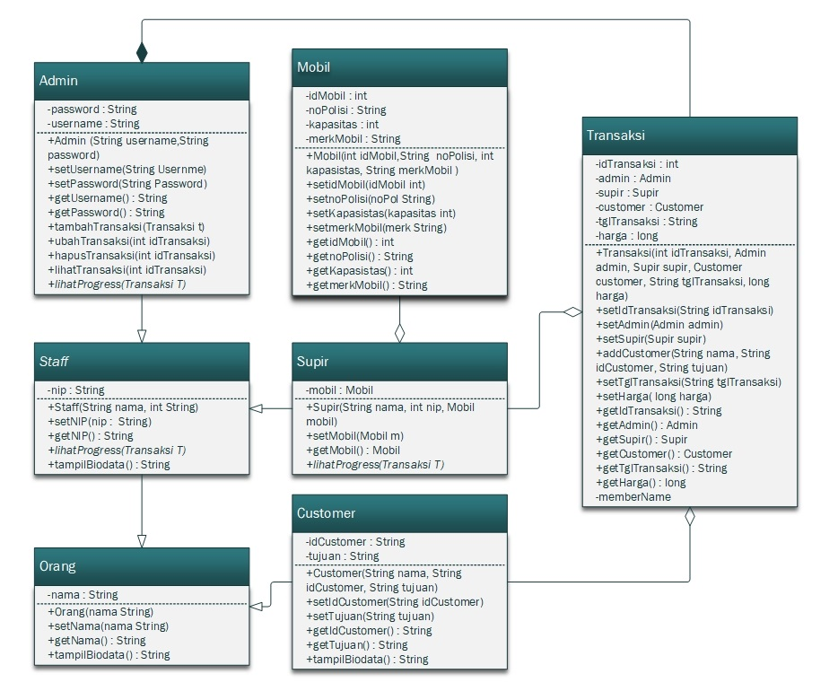

# Travel Information Application
## Introduction
KUA Administration Application is an application for support the KUA data administration process. This application manage data of prospective couples, marriage registration, and divorce registration.

## Scheme
This project implements OOP scheme like *encapsulation, relation, and inheritance* with MVC method. The application has Create, Read, Update, Delete features, and data storage manipulation.

 
